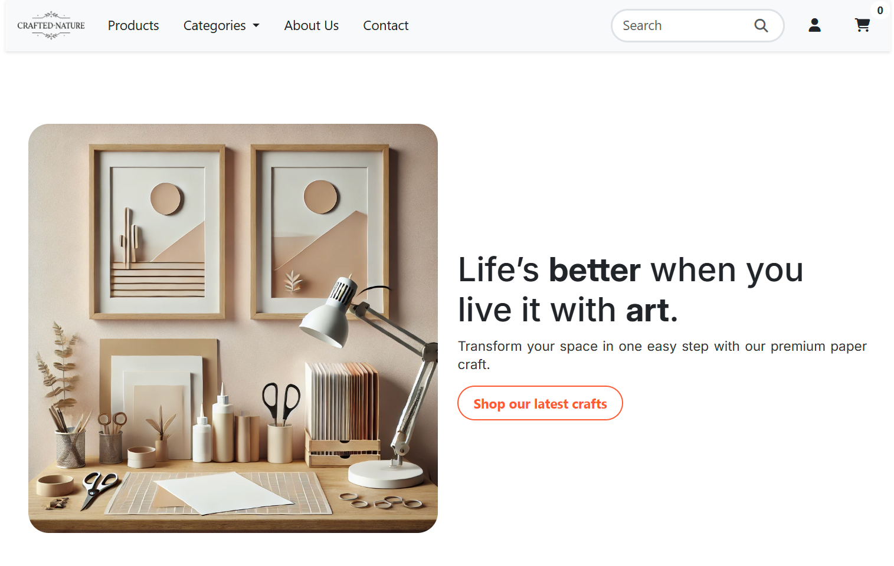

 

### The live link can be found here - [Crafted Nature](https://milestone-project-4-jp-01c67f637dac.herokuapp.com/)

# Crafted Nature

## Description

**Crafted Nature** is an e-commerce website dedicated to providing users with a seamless shopping experience for unique, handcrafted products. The website allows users to explore a diverse range of products, organized into various categories, and provides detailed information on each item, including descriptions, prices, and stock availability.

The site utilizes a **PostgreSQL database** to manage product data, user accounts, orders, and interactions. Key functionalities include browsing and searching for products, viewing detailed product information, managing user profiles, and securely processing payments through Stripe integration.

The application is built using **Django** as the backend framework, with **Django ORM** to manage database interactions. The frontend is styled with responsive CSS to ensure a seamless experience across various devices. The site is deployed on Heroku, allowing for scalability and easy access.

The main objective of Crafted Nature is to provide users with a smooth and enjoyable shopping experience, offering high-quality, handcrafted items while making the purchasing process as convenient and secure as possible.

## Site Owner Goals

As the owner of **Crafted Nature**, the primary goals of the site are:

1. **Provide a Wide Range of Products**: Offer a diverse selection of handcrafted products across various categories, ensuring that users can find unique and high-quality items. Each product listing includes detailed information to help users make informed purchasing decisions.

2. **Enhance User Engagement**: Create a user-friendly and interactive platform that encourages users to browse, discover, and engage with products. This includes features such as product browsing, detailed product pages.

3. **User Management and Personalization**: Allow users to create accounts, log in, and manage their profiles. Enable users to personalize their experience by adding products to their shopping cart, viewing their order history, and managing account information.

4. **Smooth Checkout Process**: Implement a secure and straightforward checkout process, including integration with Stripe for payment processing. This ensures a reliable and convenient purchasing experience for customers.

5. **Responsive Design**: Ensure the site is accessible and easy to use on both desktop and mobile devices, providing a seamless experience across all screen sizes.

6. **Scalability and Performance**: Utilize scalable technologies such as Heroku for deployment and PostgreSQL for data storage to handle a growing number of users and ensure the site performs well under load.

7. **Security**: Implement robust security measures to protect user data, including secure authentication, payment data encryption, and CSRF protection to ensure a safe shopping environment.

## Development Life Cycle

### Project Planning

During the project planning phase, the following steps were undertaken to ensure a structured and well-organized development process for **Crafted Nature**:

1. **Requirements Gathering**:

   - Identified the primary goals and objectives of the project, including providing a seamless shopping experience and secure payment processing.
   - Defined the core features and functionalities required for the application, such as product browsing, user authentication, shopping cart management, and order processing.

2. **Research and Analysis**:

   - Conducted research on e-commerce platforms to understand best practices for user experience, security, and product management.
   - Analyzed other handcrafted product sites to identify unique features and potential areas for improvement in user engagement and functionality.

3. **Technical Planning**:

   - Chose the Django framework for backend development due to its robust features for building e-commerce applications.
   - Selected PostgreSQL as the database system for its reliability and compatibility with Heroku for deployment.
   - Decided on using custom responsive CSS for frontend design to ensure a smooth and consistent user experience across all devices.

4. **Wireframing and Prototyping**:

   - Created wireframes and prototypes to visualize the layout and user flow of the website, including the product pages, shopping cart, and checkout process.
   - Collected feedback on the prototypes to make necessary adjustments before development commenced.

5. **Task Breakdown and Timeline**:

   - Broke down the project into manageable tasks and milestones, focusing on areas like database setup, frontend design, payment integration, and security.
   - Established a timeline for development, setting realistic deadlines for each phase to ensure steady progress.

6. **Setting Up the Development Environment**:

   - Configured version control using Git and set up a repository on GitHub for collaborative development and tracking changes.
   - Established a local development environment with necessary tools and libraries, including virtual environments, required Python packages, and PostgreSQL configuration.

### Content Requirements

_Pages and Features_

1. **Home Page**:

   - Introduction to the site and its main offerings.
   - Search bar for users to search for products by name or category.

2. **Product Details Page**:

   - Detailed information about a specific product, including:
     - Name
     - Description
     - Price
     - Stock availability
     - Product images
   - Option to add the product to the shopping cart.

3. **User Profile Page**:

   - Display user information.
   - List of past orders with order details and statuses.
   - Option to update user profile information.

4. **Shopping Cart Page**:

   - Overview of items added to the cart, with options to:
     - Adjust item quantities
     - Remove items from the cart
     - View subtotal and total prices
   - Proceed to checkout button.

5. **Checkout Page**:

   - Form for users to enter shipping and payment information.
   - Summary of items in the cart and total cost.
   - Stripe payment integration to securely handle payments.

6. **Login Page**:

   - Form for users to log in with their email and password.

7. **Registration Page**:

   - Form for new users to sign up with their username, email, and password.
   - Validation for unique usernames and emails.

### Development Life Cycle

## Development

1. **Setting Up Django Application**:
   - Initialized a Django application.
   - Configured the app with necessary settings, including database configuration for PostgreSQL and CSRF protection for secure transactions.

2. **Defining Database Models**:
   - Created Django models for `User`, `Product`, `Category`, `Cart`, `Order`, `OrderItem`, and `CartItem` to manage product listings, user shopping cart, and order processing.
   - Defined relationships between models, such as foreign keys for user accounts and products.

3. **Payment Integration**:
   - Integrated with Stripe API to securely handle payment processing during checkout.
   - Implemented functionality to validate payments and update order statuses after successful transactions.

4. **Frontend Development**:
   - Created HTML templates using Django's templating engine.
   - Styled the frontend with custom CSS to ensure responsive design across different devices, providing a smooth shopping experience for users.

## Requirements

### Functional Requirements

1. **User Authentication**:

   - Users should be able to register, log in, and log out.
   - Registered users should have a unique username and email.
   - Passwords should be hashed and stored securely to ensure user data protection.

2. **User Profile**:

   - Users should be able to view and update their profile information, including changing details like email and password.
   - Profiles should display past orders and order statuses to help users keep track of their purchases.
   - Users should have access to their profile where they can manage account information and view order history.

3. **Product Search and Display**:

   - Users should be able to search for products by name.
   - The application should display product details, including name, description, price, and stock status.
   - Product data should be organized into categories, making browsing and searching intuitive for users.

4. **Shopping Cart Management**:

   - Users should be able to add products to their shopping cart.
   - Users should be able to view and manage items in their cart, including adjusting quantities or removing items.
   - The cart should display the total cost and allow users to proceed to checkout.

5. **Checkout and Payment**:

   - Users should be able to securely enter shipping and payment information during checkout.
   - Integration with Stripe API should enable secure payment processing.
   - After successful payment, users should receive a confirmation, and order details should be saved in the database.

6. **Main Page**:

   - The main page should direct users to the product catalog.
   - Users should have immediate access to browse all available products.
   - A prominent link or button should guide users to explore product categories or search for specific items.

7. **Product Details Page**:

   - The product details page should display all relevant information about the product.
   - Users should have the option to add the product to their cart directly from this page.
   - If a product is out of stock, the page should clearly indicate this status.

8. **Responsive Design**:

   - The application should be responsive, ensuring optimal viewing on both desktop and mobile devices.
   - The layout should adapt to different screen sizes to provide a seamless shopping experience across devices.

9. **Error Handling**:

   - The application should handle errors gracefully, providing users with helpful feedback if something goes wrong.
   - User-friendly error messages should be displayed for issues such as invalid inputs, out-of-stock items, or failed payment attempts.

10. **Security**:

    - CSRF protection should be implemented to prevent cross-site request forgery.
    - All user input should be validated to prevent SQL injection, XSS, and other security vulnerabilities.
    - Passwords and sensitive user data should be securely hashed and encrypted where necessary.

### Non-Functional Requirements

1. **Performance**:

   - Database queries should be optimized for efficient data retrieval to ensure fast loading times.
   - The application should minimize resource usage and optimize images and other assets for quicker page loading.

2. **Reliability**:

   - The application should have minimal downtime, with robust error handling and stability under normal usage conditions.

3. **Usability**:

   - The user interface should be intuitive and easy to navigate, guiding users seamlessly through browsing, adding items to the cart, and completing checkout.
   - Forms, buttons, and other interactive elements should provide clear, immediate feedback to the user.

4. **Security**:

   - Sensitive data, such as user passwords and payment information, should be securely encrypted.

5. **Accessibility**:

   - The application should adhere to accessibility guidelines, including providing descriptive alt text for images, ensuring readable font sizes, and maintaining high contrast between text and background colors for users with visual impairments.
   - Navigation should be keyboard-friendly, allowing users to access all content without a mouse.

   ### Out of Scope

The following features are not included in the current scope of the **Crafted Nature** project:

1. **Product Reviews and Ratings**:

   - The functionality for users to leave reviews or rate products is not available in this version. Future updates may include features for product reviews or ratings.

2. **Advanced Inventory Management**:

   - While basic stock levels are displayed, there is no in-depth inventory management system, such as tracking product variants or supplier information.

3. **Wishlist Functionality**:

   - The option for users to save products to a wishlist is not available in the current scope. Users can add products to their cart, but wishlist features are out of scope for this release.

4. **Multiple Shipping Options**:

   - The checkout process does not offer multiple shipping options or estimated delivery times. Shipping details are handled at a basic level, with one standard shipping method available.

5. **International Currency Support**:

   - The application currently supports only one currency and does not include multi-currency or localization options.

## User Experience

### User Stories

1. **As a visitor**, I want to be able to search for products by name so that I can easily find items of interest.

2. **As a visitor**, I want to view detailed information about a product, including its description, price, and stock availability, so that I can make informed purchasing decisions.

3. **As a visitor**, I want to be able to register for an account so that I can save my details for faster checkout and track my orders.

4. **As a registered user**, I want to be able to log in and log out of my account to keep my personal information secure.

5. **As a registered user**, I want to update my profile information, such as my email or password, to keep my account information up to date.

6. **As a registered user**, I want to add items to my shopping cart to keep track of products I intend to purchase.

7. **As a registered user**, I want to view and manage items in my cart, including adjusting quantities and removing items, before completing my purchase.

8. **As a registered user**, I want to securely proceed through checkout, entering my payment and shipping details with confidence.

9. **As a registered user**, I want to view my past orders and order status on my profile page, so that I can keep track of my purchases.

10. **As a registered user**, I want to be able to contact customer support if I have questions about my order or products.

## Returning User Experience

1. **Seamless Login**:

   - Returning users can easily log in to their accounts using their registered email and password to access their shopping and profile information.

2. **Profile Management**:

   - Returning users can view and update their account information.
   - Users can see a summary of their past orders.

3. **Cart Management**:

   - Returning users can view and manage items in their shopping cart, which remains saved in their profile for easy access during their next visit.
   - They can add new items to their cart or remove items they are no longer interested in purchasing.

4. **Order History**:

   - Returning users can view their past orders directly from their profile page, allowing them to track previous purchases and order statuses.

5. **Product Search and Discovery**:

   - Users can continue to search for products by name using the search functionality.

6. **Personalized Experience**:

   - Notifications or flash messages provide feedback to users for successful actions, such as adding a product to the cart, updating profile information, or completing a purchase.

## Design

### Color Scheme

The color scheme is designed to be visually engaging and comfortable for users, creating a cohesive and modern look throughout the application. The palette includes:

- **Primary Color**: `#333`
- **Secondary Color**: `#555`
- **Accent Color**: `#007acc`
- **Background Color**: `#f4f4f9`
- **Text Color**: `#222`

### Typography

The application’s font choices ensure readability and a clean, modern look:

- **Header Font**: `'Arial'`, sans-serif
- **Body Font**: `'Inter'`

### Layout

The layout is responsive, adjusting gracefully to different screen sizes for a seamless user experience. Key design principles include:

- **Max Width**: The primary content container is set to a maximum width of `1200px` to maintain readability and a structured layout on larger screens.
- **Padding and Margin**: Consistent padding and margin ensure balanced spacing between elements, creating a clean and organized look.
- **Box Shadow**: Subtle shadows provide depth to elements, distinguishing them from the background and enhancing the visual hierarchy.

## Wireframe

Wireframe

Main Page

Category

Profile

## Screenshots

Screenshots

Main Page

Game Details

Profile

## Features

### Homepage

- **Product Search**: Users can search for products by name or category using the search bar on the homepage.
- **User Authentication**: Users can log in or register directly from the navigation bar on the homepage for quick access to their accounts.

### User Authentication

- **User Registration**: New users can create an account by providing a username, email, and password, enabling them to save profile and order information.
- **User Login**: Registered users can log in to their accounts securely using their email and password.
- **User Logout**: Logged-in users have the option to securely log out from their accounts.

### User Profile

- **Profile Page**: Users have access to a personal profile page where they can view and update their account information.
- **Order History**: Users can view a list of their past orders, with details such as order dates and statuses to help them track purchases.

### Product Details

- **Detailed Product Information**: Clicking on a product provides detailed information, including a description, price, available stock, and high-quality images.
- **Add to Cart**: Users can add products to their shopping cart directly from the product page.

### Shopping Cart

- **View Cart**: Users can view all items in their shopping cart, including item quantities and subtotal costs, with options to adjust quantities or remove items.
- **Cart Summary**: The cart displays the total cost of all items, allowing users to review their order before proceeding to checkout.

### Flash Messages

- **Feedback Messages**: Users receive feedback messages for important actions, such as adding items to the cart, successful login/logout, and completed purchases, to confirm actions.

### Responsive Design

- **Mobile-Friendly**: The application is fully responsive, ensuring a consistent and optimized experience across desktops, tablets, and mobile devices.

### Checkout and Payment

- **Secure Checkout**: Users proceed through a secure checkout where they can enter shipping and payment details.
- **Stripe Integration**: Stripe is integrated for secure and streamlined payment processing, ensuring user data security and payment reliability.

### Security

- **CSRF Protection**: The application employs CSRF tokens to guard against Cross-Site Request Forgery attacks, ensuring secure form submissions.
- **Password Hashing**: User passwords are securely hashed, with additional layers of security applied to protect sensitive information.

### Additional Features

- **Product Filtering and Sorting**: Users can filter products by category and sort items by price or popularity to streamline their shopping experience.
